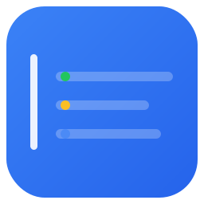

<div align="center">
    
</div>

# 🖥️ dtop

A terminal based dashboard for Docker that monitors multiple hosts in real-time.


## Overview

`dtop` provides a comprehensive summary of all Docker containers running on your system, displayed directly in your terminal. Get instant visibility into container status, resource usage, and key metrics without leaving the command line. It supports ssh, tcp and local connections and integrates with [Dozzle](https://github.com/amir20/dozzle) for container logs.

## Features

- 💻 **Real-time monitoring** - Live updates of container status and metrics
- ⚡ **Lightweight** - Insanely fast and lightweight using Rust
- 🌍 **Multi-host support** - Monitor containers across multiple hosts
- 🔍 **Dozzle** - Supports opening Dozzle links via keyboard shortcuts
- 📝 **Log streaming** - View container logs in real-time

## Roadmap

- [x] Sort containers by name and status
- [x] Implement log view streaming (basic)
- [x] Support mouse scrolling
- [x] Support TLS certs via `DOCKER_CERT_PATH`
- [x] Responsive columns for narrow view
- [x] Support stopping, starting and removing containers
- [x] Support container health status
- [x] Search or filter for containers
- [x] Support simple JSON parsing and formatting
- [ ] Add support for disk IO.
- [ ] Add support for Kubernetes clusters
- [ ] Configurable columns and saving preferences

## Installation
`dtop` can be installed through multiple package managers or by downloading the binary directly.

### Homebrew

Install using Homebrew for macOS or Linux (recommended):

```sh
brew install --cask amir20/homebrew-dtop/dtop
```

> [!NOTE]
> Homebrew is recommended as `dtop` is in active development with frequent updates. Using Homebrew will automatically upgrade `dtop`. 


### Docker
`dtop` is released as a docker image. You can pull it from Github.

```sh
docker run -v /var/run/docker.sock:/var/run/docker.sock -it ghcr.io/amir20/dtop
```

Currently, the image is available for amd64 and arm64 architectures.

### Install Script

Downloads the latest release from GitHub.

```sh
curl --proto '=https' --tlsv1.2 -LsSf https://github.com/amir20/dtop/releases/latest/download/dtop-installer.sh | sh
```

### Install from Source

`dtop` is written in Rust can be installed using Cargo.

```sh
cargo install dtop
```

## Self-Update

`dtop` includes a built-in self-update feature to easily upgrade to the latest version:

```sh
dtop update
```

This command will:
- Check GitHub releases for the latest version
- Download and install the update if a newer version is available
- Automatically replace the current binary with the new version

> [!Note]
> The self-update feature is only available in binaries installed via the install script or downloaded from GitHub releases. Docker images should be updated by pulling the latest image, and cargo installations should use `cargo install dtop --force`.

## Command Line Options

By default, `dtop` will connect to the local Docker daemon using `/var/run/docker.sock`. `DOCKER_HOST` is also supported to connect to other hosts.

```
> dtop --help
A terminal-based Docker container monitoring tool with real-time CPU and memory metrics

Usage: dtop [OPTIONS] [COMMAND]

Commands:
  update  Update dtop to the latest version
  help    Print this message or the help of the given subcommand(s)

Options:
  -H, --host <HOST>
          Docker host(s) to connect to. Can be specified multiple times.
          
          Examples:
            --host local                    (Connect to local Docker daemon)
            --host ssh://user@host          (Connect via SSH)
            --host ssh://user@host:2222     (Connect via SSH with custom port)
            --host tcp://host:2375          (Connect via TCP to remote Docker daemon)
            --host tls://host:2376          (Connect via TLS)
            --host local --host ssh://user@server1 --host tls://server2:2376  (Multiple hosts)
          
          For TLS connections, set DOCKER_CERT_PATH to a directory containing:
            key.pem, cert.pem, and ca.pem
          
          If not specified, will use config file or default to "local"

  -i, --icons <ICONS>
          Icon style to use for the UI
          
          Options:
            unicode  - Standard Unicode icons (default, works everywhere)
            nerd     - Nerd Font icons (requires Nerd Font installed)

  -f, --filter <FILTER>
          Filter containers (can be specified multiple times)
          
          Examples:
            --filter status=running
            --filter name=nginx
            --filter label=com.example.version=1.0
            --filter ancestor=ubuntu:24.04
          
          Multiple filters of the same type use OR logic:
            --filter status=running --filter status=paused
          
          Different filter types use AND logic:
            --filter status=running --filter name=nginx
          
          Available filters:
            id, name, label, status, ancestor, before, since,
            volume, network, publish, expose, health, exited
          
          Note: Some filters only work with container listing, not events.
          Warnings will be shown if a filter is incompatible with events.

  -a, --all
          Show all containers (default shows only running containers)
          
          By default, dtop only shows running containers.
          Use this flag to show all containers including stopped, exited, and paused containers.
          
          Note: This flag can only enable showing all containers, not disable it.
          If your config file has 'all: true', you'll need to edit the config file
          or press 'a' in the UI to toggle back to showing only running containers.
          
          This is equivalent to pressing 'a' in the UI to toggle show all.

  -h, --help
          Print help (see a summary with '-h')

  -V, --version
          Print version

```

## Configuration File

`dtop` supports command line flags or configuration file. The configuration file reads from the following locations (in priority order):

1. `./config.yaml` or `./config.yml`
2. `./.dtop.yaml` or `./.dtop.yml`
3. `~/.config/dtop/config.yaml` or `~/.config/dtop/config.yml`
4. `~/.dtop.yaml` or `~/.dtop.yml`

> [!Note]
> Both `yaml` and `yml` files are supported.

Here's an example configuration:

```yaml
# Monitor production servers with filters and Dozzle integration
hosts:
  - host: ssh://user@prod-server1
    dozzle: https://dozzle.prod-server1.com/
    filter:
      - status=running
      - label=environment=production

  - host: ssh://user@prod-server2
    dozzle: https://dozzle.prod-server2.com/
    filter:
      - status=running
      - label=environment=production

# Use Nerd Font icons for better visuals
icons: nerd
```

**Or monitor specific application stacks:**

```yaml
# Development environment - only show healthy web services
hosts:
  - host: local
    filter:
      - label=app=web
      - status=running
      - health=healthy
```

See [config.example.yaml](https://github.com/amir20/dtop/blob/master/config.example.yaml) for more examples.

## Nerd Font Icons

`dtop` supports [Nerd Fonts](https://www.nerdfonts.com/) for enhanced icon display. Nerd Fonts are fonts that have been patched to include additional glyphs and icons commonly used in terminal applications.

### Installing Nerd Fonts

1. Visit [nerdfonts.com/font-downloads](https://www.nerdfonts.com/font-downloads)
2. Download a patched font (e.g., "FiraCode Nerd Font", "JetBrainsMono Nerd Font")
3. Install the font on your system
4. Configure your terminal emulator to use the Nerd Font

### Using Nerd Font Icons

Once you have a Nerd Font installed and configured in your terminal, enable Nerd Font icons in `dtop`:

```bash
# Via command line
dtop --icons nerd

# Or in config file
icons: nerd
```

> [!Note]
> If icons appear as boxes or question marks, ensure your terminal is using a Nerd Font. The default `unicode` mode works with any terminal font.

## Supported Connections

### Local Docker

Monitor containers running on the local Docker daemon using `--host local`. `dtop` respects the `DOCKER_HOST` environment variable. If `DOCKER_HOST` is not set, it falls back to the default Docker socket location (`/var/run/docker.sock` on Linux/macOS).

```bash
dtop --host local
# or simply
dtop
```

### Remote HTTP Docker

Connect to remote Docker daemons over unencrypted TCP connections. This is useful for development environments but should only be used on trusted networks.

```bash
dtop --host tcp://host2:2375
```

> [!Warning]
> TCP connections are unencrypted. Only use on trusted networks or with proper firewall rules.

### Remote TLS Docker

Connect to remote Docker daemons over encrypted TLS connections. Requires certificates to be configured via the `DOCKER_CERT_PATH` environment variable.

```bash
export DOCKER_CERT_PATH=/path/to/certs  # Directory containing key.pem, cert.pem, and ca.pem
dtop --host tls://host2:2376
```

### SSH

Establish an SSH connection to a remote host and monitor containers running on it. This is the recommended method for secure remote connections.

```bash
dtop --host ssh://user@host
# With custom port
dtop --host ssh://user@host:2222
```

### Multiple Hosts

You can monitor multiple Docker hosts simultaneously by specifying multiple `--host` flags:

```bash
dtop --host local --host tcp://host2:2375 --host ssh://user@host
```

> [!Note]
> Currently, Dozzle url can only be configured in the configuration file. There is no way to provide it directly in the command line flags.

## Related Projects & Inspirations

I am a big fan of [ctop](https://github.com/bcicen/ctop). `ctop` inspired me to create Dozzle but in the browser. However, it seems like `ctop` is no longer maintained. I considered forking `ctop` but deploying with same name would be challenging. I created `dtop` for my personal use case. I often want to see all my containers at a glance across multiple hosts. `dtop` achieves that by supporting remote hosts via `ssh` or `tcp`. Additionally, since I use Dozzle, I integrated Dozzle into `dtop` to provide a seamless experience for monitoring container logs.


## Contributing

Contributions are welcome! Please feel free to submit a Pull Request.

## License

MIT License - see LICENSE file for details.
